# ✅ Section 04: How Node.js works: A look behind the scenes


## 📚 Lecture 030: Node, V8, Libuv and C++
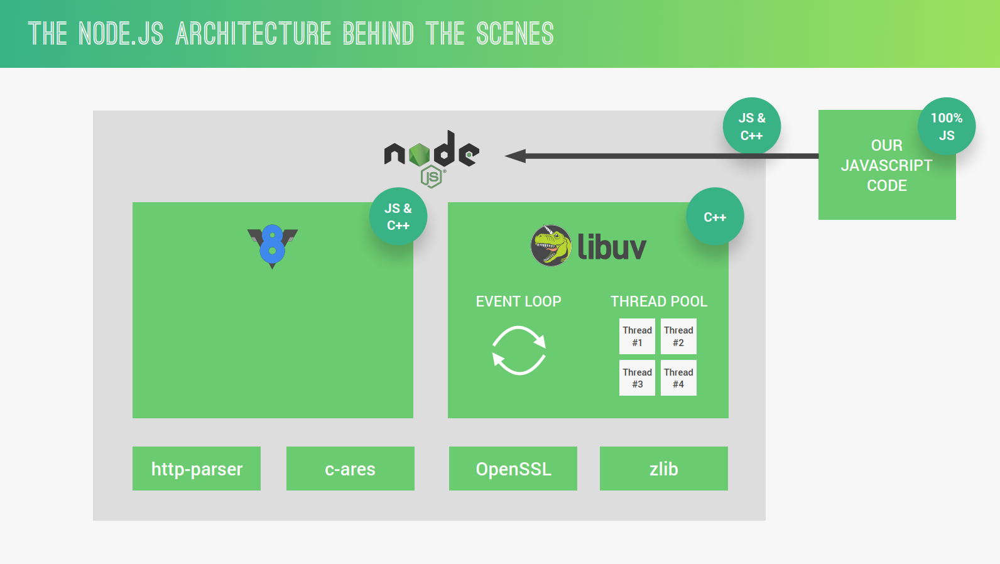


## 📚 Lecture 031: Processes, Threads and the Thread Pool
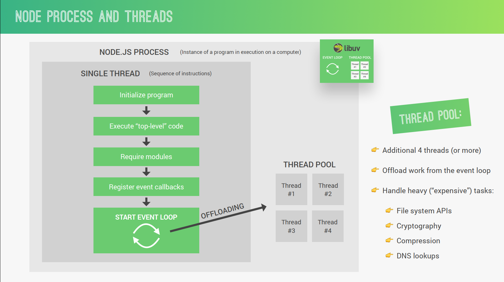

## 📚 Lecture 032: The Node.js Event Loop

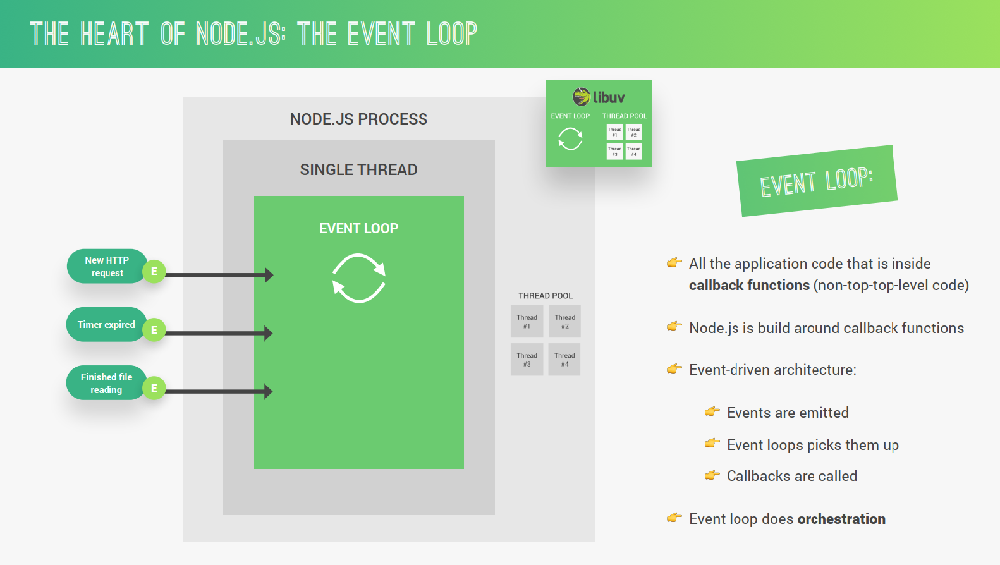
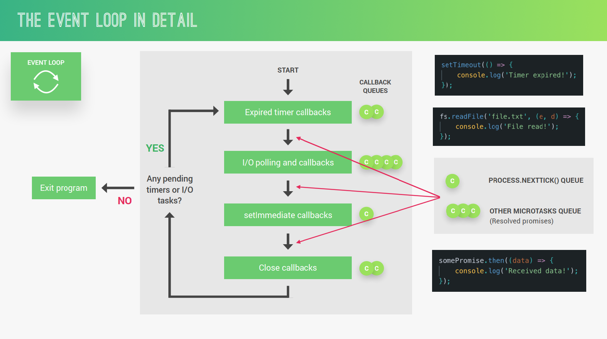
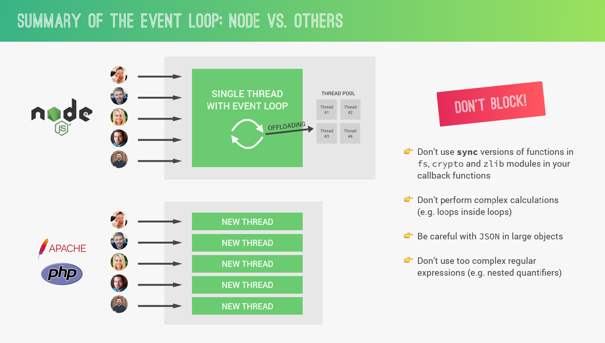


## 📚 Lecture 033: The Event Loop in Practice

### 1. Having this project structure:
```
02-how-node-works
├── README.md
├── event-loop.js
├── img/
│   └── ...
└── test-file.txt
```

### 2. Know how Event loop works:
```js
const fs = require('fs');

setTimeout( () => console.log("1️⃣ Timer 1 finished"), 0);
setImmediate( () => console.log("2️⃣ Immediate 1 finished"));

fs.readFile('test-file.txt', () => {
  console.log('3️⃣ I/O finished');
})

console.log("4️⃣ Hello from the top level code")
```

#### Outcome:
```
4️⃣ Hello from the top level code
1️⃣ Timer 1 finished
2️⃣ Immediate 1 finished
3️⃣ I/O finished
```

### 3. New situation with 
```js
const fs = require('fs');

setTimeout( () => console.log("1️⃣ Timer 1 finished"), 0);
setImmediate( () => console.log("2️⃣ Immediate 1 finished"));

fs.readFile('test-file.txt', () => {
  console.log('3️⃣ I/O finished');
  setTimeout( () => console.log("4️⃣ Timer 2 finished"), 0);
  setTimeout( () => console.log("5️⃣ Timer 3 finished"), 3000);
  setImmediate( () => console.log("6️⃣ Immediate 1 finished"));
})

console.log("7️⃣ Hello from the top level code")
```

#### Outcome:
```txt
7️⃣ Hello from the top level code
1️⃣ Timer 1 finished
2️⃣ Immediate 1 finished
3️⃣ I/O finished
6️⃣ Immediate 1 finished
4️⃣ Timer 2 finished
5️⃣ Timer 3 finished // 3 seconds delayed
```

### 3. More complex situation:
```js
const fs = require('fs');
const crypto = require('crypto');

const start = Date.now();

setTimeout( () => console.log("1️⃣  Timer 1 finished"), 0);
setImmediate( () => console.log("2️⃣  Immediate 1 finished"));

fs.readFile('test-file.txt', () => {
  console.log('3️⃣  I/O finished');
  console.log("-----------------------")
  setTimeout( () => console.log("4️⃣  Timer 2 finished - 1 second after I/O & 6️⃣"), 1000);
  setTimeout( () => console.log("5️⃣  Timer 3 finished - 3 seconds after I/O & 6️⃣"), 3000);
  setImmediate( () => console.log("6️⃣  Immediate 1 finished"));
  
  process.nextTick( () => console.log("8️⃣  Next Tick 1 finished"))

  crypto.pbkdf2("password", "salt" , 100000, 1024,  "sha512", () => {
    console.log(Date.now() - start, "Password encrypted");
  })
})

console.log("7️⃣  Hello from the top level code")
```

#### outcome:
```
7️⃣  Hello from the top level code
1️⃣  Timer 1 finished
2️⃣  Immediate 1 finished
3️⃣  I/O finished
-----------------------
8️⃣  Next Tick 1 finished
6️⃣  Immediate 1 finished
515 Password encrypted
4️⃣  Timer 2 finished - 1 second after I/O & 6️⃣
5️⃣  Timer 3 finished - 3 seconds after I/O & 6️⃣
```

### 4. New situation with many crypto process:
```js
const fs = require('fs');
const crypto = require('crypto');

const start = Date.now();

setTimeout( () => console.log("1️⃣  Timer 1 finished"), 0);
setImmediate( () => console.log("2️⃣  Immediate 1 finished"));

fs.readFile('test-file.txt', () => {
  console.log('3️⃣  I/O finished');
  console.log("-----------------------")
  setTimeout( () => console.log("4️⃣  Timer 2 finished - 1 second after I/O & 6️⃣"), 1000);
  setTimeout( () => console.log("5️⃣  Timer 3 finished - 3 seconds after I/O & 6️⃣"), 3000);
  setImmediate( () => console.log("6️⃣  Immediate 1 finished"));
  
  process.nextTick( () => console.log("8️⃣  Next Tick 1 finished"))

  crypto.pbkdf2("password", "salt" , 100000, 1024,  "sha512", () => {
    console.log(Date.now() - start, "Password encrypted");
  });

  crypto.pbkdf2("password", "salt" , 100000, 1024,  "sha512", () => {
    console.log(Date.now() - start, "Password encrypted");
  });

  crypto.pbkdf2("password", "salt" , 100000, 1024,  "sha512", () => {
    console.log(Date.now() - start, "Password encrypted");
  });

  crypto.pbkdf2("password", "salt" , 100000, 1024,  "sha512", () => {
    console.log(Date.now() - start, "Password encrypted");
  });
})

console.log("7️⃣  Hello from the top level code")
```

#### outcome:
```
7️⃣  Hello from the top level code
1️⃣  Timer 1 finished
2️⃣  Immediate 1 finished
3️⃣  I/O finished
-----------------------
8️⃣  Next Tick 1 finished
6️⃣  Immediate 1 finished
561 Password encrypted
577 Password encrypted
588 Password encrypted
594 Password encrypted
4️⃣  Timer 2 finished - 1 second after I/O & 6️⃣
5️⃣  Timer 3 finished - 3 seconds after I/O & 6️⃣
```

### 5. One threadpoll_size only:
```js
const fs = require('fs');
const crypto = require('crypto');

const start = Date.now();
process.env.UV_THREADPOOL_SIZE = 1;

setTimeout( () => console.log("1️⃣  Timer 1 finished"), 0);
setImmediate( () => console.log("2️⃣  Immediate 1 finished"));

fs.readFile('test-file.txt', () => {
  console.log('3️⃣  I/O finished');
  console.log("-----------------------")
  setTimeout( () => console.log("4️⃣  Timer 2 finished - 1 second after I/O & 6️⃣"), 1000);
  setTimeout( () => console.log("5️⃣  Timer 3 finished - 3 seconds after I/O & 6️⃣"), 3000);
  setImmediate( () => console.log("6️⃣  Immediate 1 finished"));
  
  process.nextTick( () => console.log("8️⃣  Next Tick 1 finished"))

  crypto.pbkdf2("password", "salt" , 100000, 1024,  "sha512", () => {
    console.log(Date.now() - start, "Password encrypted");
  });

  crypto.pbkdf2("password", "salt" , 100000, 1024,  "sha512", () => {
    console.log(Date.now() - start, "Password encrypted");
  });

  crypto.pbkdf2("password", "salt" , 100000, 1024,  "sha512", () => {
    console.log(Date.now() - start, "Password encrypted");
  });

  crypto.pbkdf2("password", "salt" , 100000, 1024,  "sha512", () => {
    console.log(Date.now() - start, "Password encrypted");
  });
})

console.log("7️⃣  Hello from the top level code")
```

#### outcome:
```
7️⃣  Hello from the top level code
1️⃣  Timer 1 finished
2️⃣  Immediate 1 finished
3️⃣  I/O finished
-----------------------
8️⃣  Next Tick 1 finished
6️⃣  Immediate 1 finished
506 Password encrypted
1004 Password encrypted
4️⃣  Timer 2 finished - 1 second after I/O & 6️⃣
1505 Password encrypted
2001 Password encrypted
5️⃣  Timer 3 finished - 3 seconds after I/O & 6️⃣
```

### 6. pbkdf2Sync version:
```js
const fs = require('fs');
const crypto = require('crypto');

const start = Date.now();
process.env.UV_THREADPOOL_SIZE = 4;

setTimeout( () => console.log("1️⃣  Timer 1 finished"), 0);
setImmediate( () => console.log("2️⃣  Immediate 1 finished"));

fs.readFile('test-file.txt', () => {
  console.log('3️⃣  I/O finished');
  console.log("-----------------------")
  setTimeout( () => console.log("4️⃣  Timer 2 finished - 1 second after I/O & 6️⃣"), 1000);
  setTimeout( () => console.log("5️⃣  Timer 3 finished - 3 seconds after I/O & 6️⃣"), 3000);
  setImmediate( () => console.log("6️⃣  Immediate 1 finished"));
  
  process.nextTick( () => console.log("8️⃣  Next Tick 1 finished"))

  // using Sync version of 
  crypto.pbkdf2Sync("password", "salt" , 100000, 1024,  "sha512")
  console.log(Date.now() - start, "Password encrypted");

  crypto.pbkdf2Sync("password", "salt" , 100000, 1024,  "sha512")
  console.log(Date.now() - start, "Password encrypted");

  crypto.pbkdf2Sync("password", "salt" , 100000, 1024,  "sha512")
  console.log(Date.now() - start, "Password encrypted");

  crypto.pbkdf2Sync("password", "salt" , 100000, 1024,  "sha512")
  console.log(Date.now() - start, "Password encrypted");

  crypto.pbkdf2Sync("password", "salt" , 100000, 1024,  "sha512")
  console.log(Date.now() - start, "Password encrypted");
})

console.log("7️⃣  Hello from the top level code")
```

#### Outcome:
```
7️⃣  Hello from the top level code
1️⃣  Timer 1 finished
2️⃣  Immediate 1 finished
3️⃣  I/O finished
-----------------------
517 Password encrypted
1020 Password encrypted
1526 Password encrypted
2031 Password encrypted
2541 Password encrypted
8️⃣  Next Tick 1 finished
6️⃣  Immediate 1 finished
4️⃣  Timer 2 finished - 1 second after I/O & 6️⃣
5️⃣  Timer 3 finished - 3 seconds after I/O & 6️⃣
```

## 📚 Lecture 034: Events and Event-Driven Architecture


## 📚 Lecture 035: Events in Practice

### 1. Create **`event.js`** file:
```js
// ./event.js
const EventEmitter = require("events");
const myEmitter = new EventEmitter();

myEmitter.on("newSale", () => {
  console.log("There was a new sale!");
});
myEmitter.emit("newSale");
```

> then run **`node. event.js`** from terminal:
```bash
There was a new sale!
```

### 2. Add a new listener in **`event.js`** file:
```js
// ./event.js
const EventEmitter = require("events");
const myEmitter = new EventEmitter();

myEmitter.on("newSale", () => {
  console.log("There was a new sale!");
});
myEmitter.on("newSale", () => {
  console.log("Customer name: Luiggie!");
});
myEmitter.emit("newSale");
```

> then run **`node. event.js`** from terminal:
```
There was a new sale!
Customer name: Luiggie!
```

### 3. Send an argument through a listener in **`event.js`** file:
```js
// ./event.js
const EventEmitter = require("events");
const myEmitter = new EventEmitter();

myEmitter.on("newSale", () => {
  console.log("There was a new sale!");
});
myEmitter.on("newSale", () => {
  console.log("Customer name: Luiggie!");
});
myEmitter.on("newSale", (stock) => {
  console.log(`There are now ${stock} items left in stock.`);
});
myEmitter.emit("newSale", 9);
```

> then run **`node. event.js`** from terminal:
```
There was a new sale!
Customer name: Luiggie!
There are now 9 items left in stock.
```

### 4. Add a class as new Event Emitter object in **`event.js`** file:
```js
// ./event.js
const EventEmitter = require("events");
class Sales extends EventEmitter{
  constructor() {
    super();
  }
}
const myEmitter = new Sales();
myEmitter.on("newSale", () => {
  console.log("There was a new sale!");
});
myEmitter.on("newSale", () => {
  console.log("Customer name: Luiggie!");
});
myEmitter.on("newSale", (stock) => {
  console.log(`There are now ${stock} items left in stock.`);
});
myEmitter.emit("newSale", 9);
```

> then run **`node. event.js`** from terminal:
```
There was a new sale!
Customer name: Luiggie!
There are now 9 items left in stock.
```

### 5. Create a new server with http:
```js
// ./event.js
const EventEmitter = require("events");
const server = http.createServer();
server.on("request", (req, res) => {
  console.log("Request received!"); // see it from server/terminal
  res.end("Request received"); // see it from client/browser
});
server.listen(8000, "127.0.0.1", () => {
  console.log("Waiting for requests... ⏰");
})
```
> then run **`node. event.js`** from terminal:

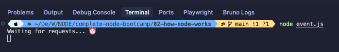

> open a browser with **`http://localhost:8000`**:


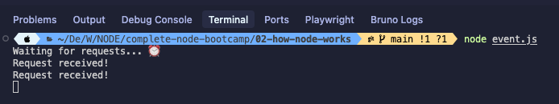

### 6. Crate more Request:
```js
// ./event.js
const EventEmitter = require("events");
server.on("request", (req, res) => {
  console.log("Request received!"); // see it from server/terminal
  console.log(req.url);
  res.end("Request received"); // see it from client/browser
});

server.on("request", (req, res) => {
  console.log("Another Request 🥳!"); 
});

server.listen(8000, "127.0.0.1", () => {
  console.log("Waiting for requests... ⏰");
})
```
> then run **`node. event.js`** from terminal:
> open a browser with **`http://localhost:8000`**:

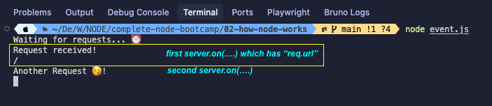


## 📚 Lecture 036: Introduction to Streams

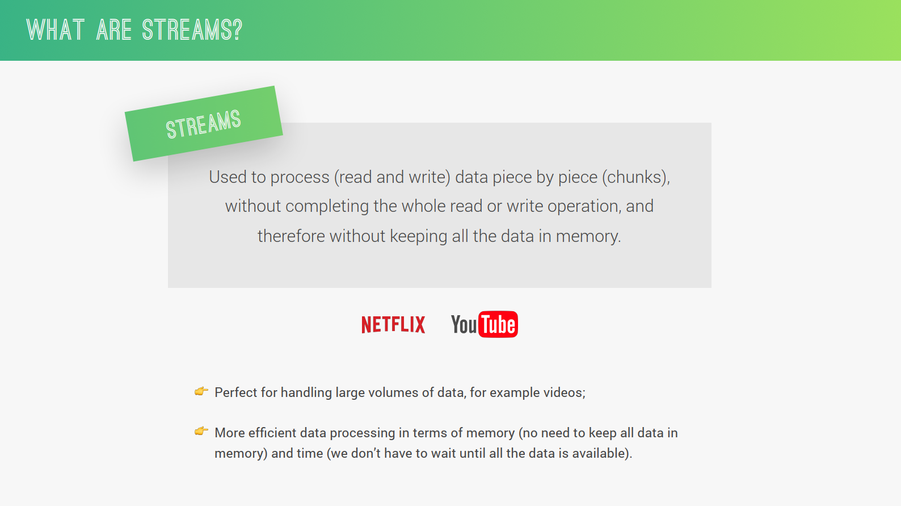
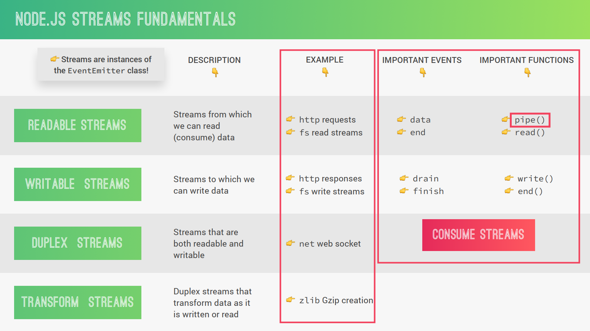

## 📚 Lecture 037: Streams in Practice

### 1. Create the **`streams.js`** file - first solution:
```js
// Import the File System module to handle file operations
const fs = require('fs'); 
// Import HTTP module and create a basic HTTP server
const server = require('http').createServer(); 

// Set up event listener for incoming HTTP requests
server.on('request', (req, res) => {
  // ******* SOLUTION 01: Basic file reading and serving *******
  // This method reads the entire file into memory before sending it
  // Not suitable for large files or high traffic (blocks the event loop)
  fs.readFile("test-file.txt", (err, data) => {
    // Handle potential errors (e.g., file not found, permissions)
    if(err) console.log(err);
    // Send the file content as response and end the connection
    res.end(data);
  });
});

// Start the server on port 8000 and IP 127.0.0.1 (localhost)
server.listen(8000, "127.0.0.1", () => {
  console.log('Listening to requests on port 8000... ⏰');
});
```

> Best for: Small files (< 100MB), low traffic applications


### 2. Second solution using stream:
```js
// Import the File System module to handle file operations
const fs = require('fs'); 
// Import HTTP module and create a basic HTTP server
const server = require('http').createServer(); 

// Set up event listener for incoming HTTP requests
server.on('request', (req, res) => {
  // SOLUTION 02: Using Streams for better memory efficiency
  // Create a readable stream to read the file in chunks
  // This is more efficient than loading the entire file into memory at once
  const readable = fs.createReadStream('test-file.txt');
  
  // Event listener for when data chunks are available from the file
  readable.on('data', (chunk) => {
    // Write each chunk of data to the HTTP response
    // This sends data to the client as it's being read from the file
    res.write(chunk);
  });
  
  // Event listener for when the file reading is complete
  readable.on('end', () => {
    // End the HTTP response after all data has been sent
    res.end();
  });
  
  // Note: Missing error handling for the readable stream
  // If the file doesn't exist or has permission issues, this will crash
  
  // POTENTIAL ISSUE: Backpressure
  // If the response can't send data as fast as we're reading from the file,
  // it can lead to memory buildup and performance problems
})

// Start the server on port 8000 and IP 127.0.0.1 (localhost)
server.listen(8000, "127.0.0.1", () =>{
  console.log('Listening to requests on port 8000... ⏰');
});
```

Adding error handler:
```js
  readable.on('error', (err) => {
    console.log(err);
    res.statusCode = 500;
    res.end('Error: File not found');
  });
```

> reading **`testj-file.txt`**:
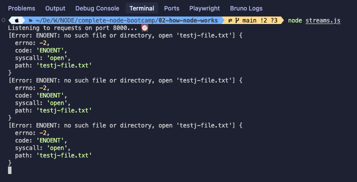

> Issue: If res.write() returns false (backpressure), we should pause the readable stream

### 3. ReadStream with **`pipe`**:
```js
const fs = require('fs'); 
const server = require('http').createServer(); 
server.on('request', (req, res) => {
  //solution 03:
  const readable = fs.createReadStream("test-file.txt");
  readable.pipe(res);
  // readableSource.pipe(writeableDestination)
})
server.listen(8000, "127.0.0.1", () =>{
  console.log('Listening to requests on port 8000... ⏰');
})
```

### 4. Comparative Table

| Solution | PROS | CONS | Why Move to Next Solution |
|----------|------|------|---------------------------|
| **Solution 01**<br>`fs.readFile()` | • Simple to implement<br>• Easy error handling<br>• Good for small files | • **Loads entire file into memory**<br>• Blocks event loop for large files<br>• High memory usage<br>• Can crash server with large files | Memory inefficiency and scalability issues with large files or multiple concurrent requests |
| **Solution 02**<br>`createReadStream()` with events | • **Memory efficient** (streams data in chunks)<br>• Non-blocking<br>• Good for large files<br>• Can handle backpressure manually | • **Manual backpressure management required**<br>• More complex code<br>• Risk of memory buildup if response is slow<br>• Multiple event listeners to manage | Backpressure handling is complex and error-prone; manual stream management increases code complexity |
| **Solution 03**<br>`pipe()` method | • **Automatic backpressure handling**<br>• Most elegant solution<br>• Memory efficient<br>• Handles flow control automatically<br>• Less code to maintain | • Limited control over data flow<br>• Error handling must be set up on both streams<br>• Less flexibility for data transformation | Provides all benefits of streaming with automatic backpressure management and cleaner code |


## 📚 Lecture 038: How Requiring Modules Really Works

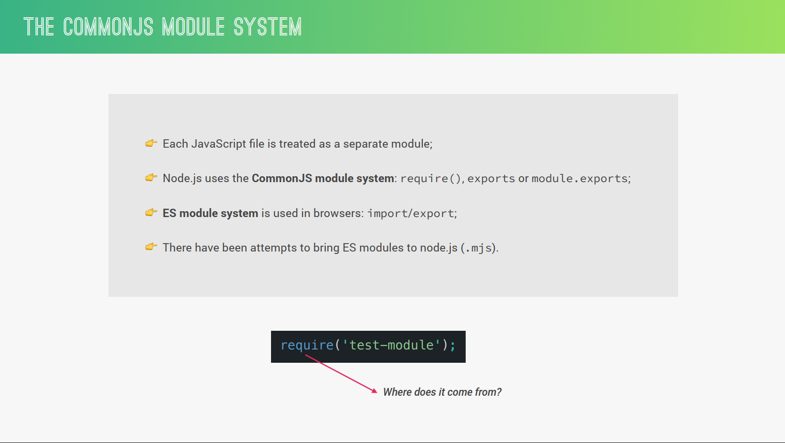
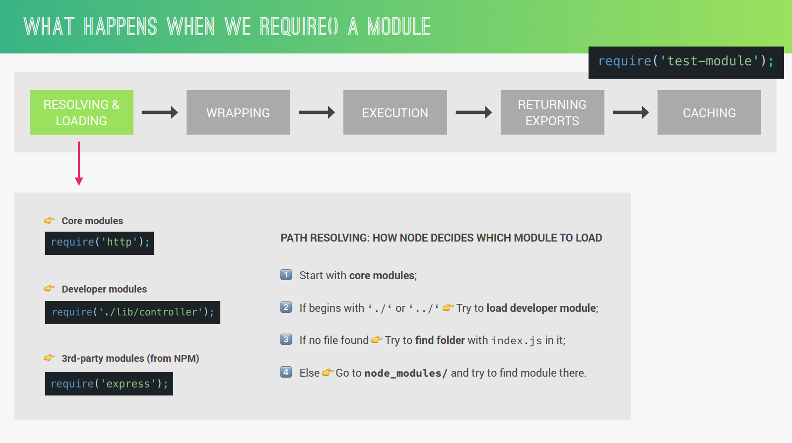
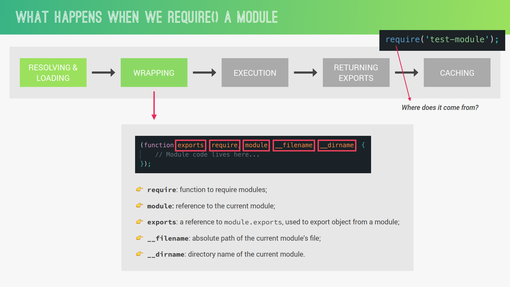
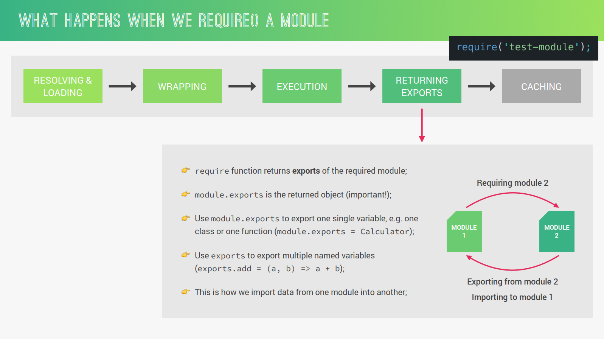
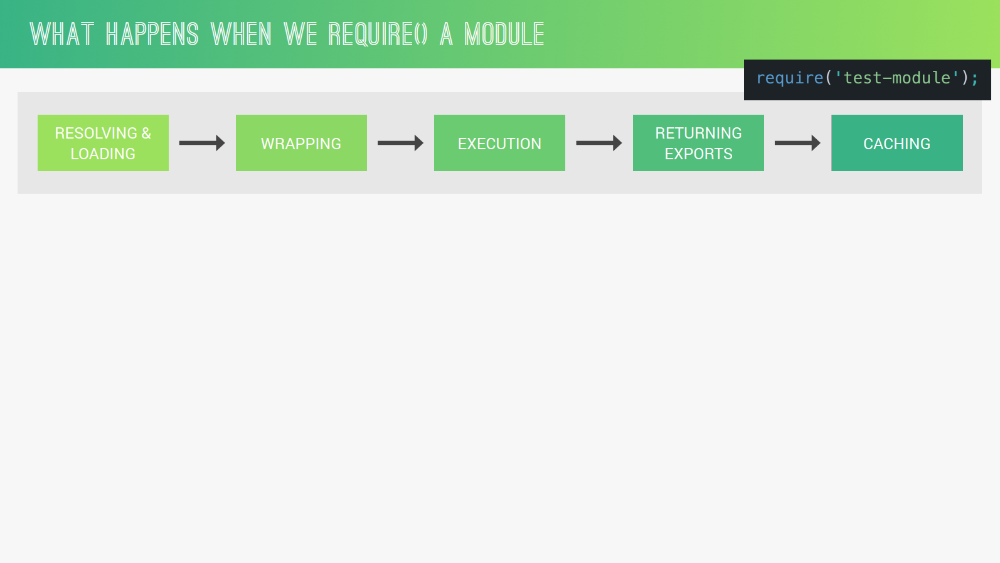


## 📚 Lecture 0